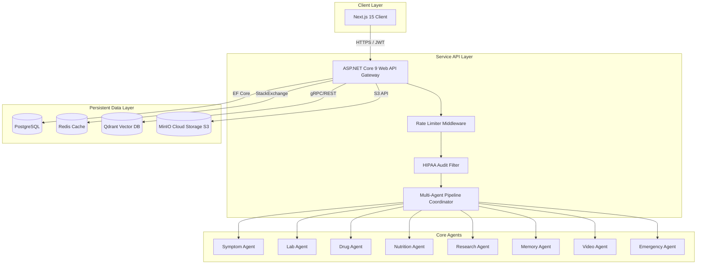
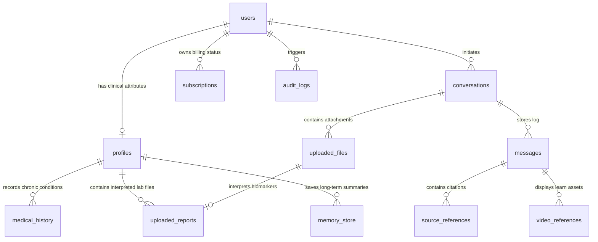

# Clinica AI – Architecture & Database Schema

This document outlines the high-level architecture designs, service integrations, and relational database schema configurations for the **Clinica AI** SaaS platform.

## Architecture Topology

The application uses a containerized multi-tier model orchestrated by Docker Compose (and deployable to Kubernetes).

### Key Subsystems:
1. **Three-Column Dashboard**: Left side sidebar settings, Center chat stream upload actions, Right side citations learning assets.
2. **HIPAA Security Auditing**: Middleware intercepting every route that handles or reads PHI (Protected Health Information), saving logs to `audit_logs`.
3. **Dual-Mode LLM Client**: Fail-safe clinical routing in C# that automatically defaults to deterministic medical rule matching and NLP diagnostics when external OpenAI credentials are unset.

---

## Database Relational Schema (PostgreSQL)

### Table Specifications:

#### 1. `users`
- `Id`: `UUID` (Primary Key)
- `Email`: `VARCHAR(150)` (Unique Index)
- `PasswordHash`: `VARCHAR(255)`
- `FullName`: `VARCHAR(100)`
- `Role`: `INT` (0=Free, 1=Premium, 2=Professional, 3=Admin)
- `IsEmailVerified`: `BOOLEAN`
- `EmailVerificationToken`: `VARCHAR(100)`
- `PasswordResetToken`: `VARCHAR(100)`
- `ResetTokenExpiry`: `TIMESTAMP`
- `CreatedAt` / `UpdatedAt`: `TIMESTAMP`

#### 2. `profiles`
- `Id`: `UUID` (Primary Key)
- `UserId`: `UUID` (Foreign Key -> `users.Id`, Cascade)
- `Age`: `INT`
- `Gender`: `VARCHAR(50)`
- `Country`: `VARCHAR(100)`
- `StateRegion`: `VARCHAR(100)`
- `Height`: `DOUBLE PRECISION`
- `Weight`: `DOUBLE PRECISION`
- `BloodGroup`: `VARCHAR(10)`
- `KnownConditions`: `TEXT`
- `Allergies`: `TEXT`
- `CurrentMedications`: `TEXT`
- `MedicalHistory`: `TEXT`
- `CreatedAt` / `UpdatedAt`: `TIMESTAMP`

#### 3. `conversations`
- `Id`: `UUID` (Primary Key)
- `UserId`: `UUID` (Foreign Key -> `users.Id`, Cascade)
- `Title`: `VARCHAR(200)`
- `CreatedAt` / `UpdatedAt`: `TIMESTAMP`

#### 4. `messages`
- `Id`: `UUID` (Primary Key)
- `ConversationId`: `UUID` (Foreign Key -> `conversations.Id`, Cascade)
- `Sender`: `VARCHAR(50)` ("User", "AI")
- `Content`: `TEXT`
- `StructuredResponseJson`: `TEXT` (Houses details: causes, risk levels, lifestyle etc.)
- `CreatedAt`: `TIMESTAMP`

#### 5. `medical_history`
- `Id`: `UUID` (Primary Key)
- `ProfileId`: `UUID` (Foreign Key -> `profiles.Id`, Cascade)
- `Condition`: `VARCHAR(200)`
- `Status`: `VARCHAR(50)` (Active, Resolved, Managed)
- `DiagnosedDate`: `TIMESTAMP`
- `Notes`: `TEXT`
- `CreatedAt`: `TIMESTAMP`

#### 6. `uploaded_files`
- `Id`: `UUID` (Primary Key)
- `ConversationId`: `UUID` (Foreign Key -> `conversations.Id`, Cascade)
- `FileName`: `VARCHAR(255)`
- `FilePath`: `VARCHAR(500)` (Cloud Key/Proxy URL)
- `FileSize`: `BIGINT`
- `MimeType`: `VARCHAR(100)`
- `ExtractedText`: `TEXT`
- `UploadedAt`: `TIMESTAMP`

#### 7. `uploaded_reports`
- `Id`: `UUID` (Primary Key)
- `FileId`: `UUID` (Foreign Key -> `uploaded_files.Id`, Cascade)
- `ProfileId`: `UUID` (Foreign Key -> `profiles.Id`, Cascade)
- `ReportType`: `VARCHAR(100)` (CBC, Thyroid, etc.)
- `Summary`: `TEXT`
- `AbnormalFindings`: `TEXT`
- `FullInterpretationJson`: `TEXT`
- `InterpretedAt`: `TIMESTAMP`

#### 8. `memory_store`
- `Id`: `UUID` (Primary Key)
- `ProfileId`: `UUID` (Foreign Key -> `profiles.Id`, Cascade)
- `Key`: `VARCHAR(100)` ("past_diagnoses", "allergies", etc.)
- `Value`: `TEXT`
- `UpdatedAt`: `TIMESTAMP`

#### 9. `source_references`
- `Id`: `UUID` (Primary Key)
- `MessageId`: `UUID` (Foreign Key -> `messages.Id`, Cascade)
- `SourceName`: `VARCHAR(100)`
- `Title`: `VARCHAR(250)`
- `URL`: `VARCHAR(500)`
- `Snippet`: `TEXT`

#### 10. `video_references`
- `Id`: `UUID` (Primary Key)
- `MessageId`: `UUID` (Foreign Key -> `messages.Id`, Cascade)
- `Title`: `VARCHAR(250)`
- `ThumbnailUrl`: `VARCHAR(500)`
- `DurationString`: `VARCHAR(20)`
- `ChannelName`: `VARCHAR(100)`
- `VideoUrl`: `VARCHAR(500)`

#### 11. `subscriptions`
- `Id`: `UUID` (Primary Key)
- `UserId`: `UUID` (Foreign Key -> `users.Id`, Cascade)
- `PlanType`: `INT` (Free, Premium, Pro, Admin)
- `StartDate` / `EndDate`: `TIMESTAMP`
- `IsActive`: `BOOLEAN`

#### 12. `audit_logs`
- `Id`: `UUID` (Primary Key)
- `UserId`: `UUID` (Foreign Key -> `users.Id`, Nullable, SetNull)
- `Action`: `VARCHAR(150)`
- `IpAddress`: `VARCHAR(100)`
- `Details`: `TEXT`
- `Timestamp`: `TIMESTAMP`
